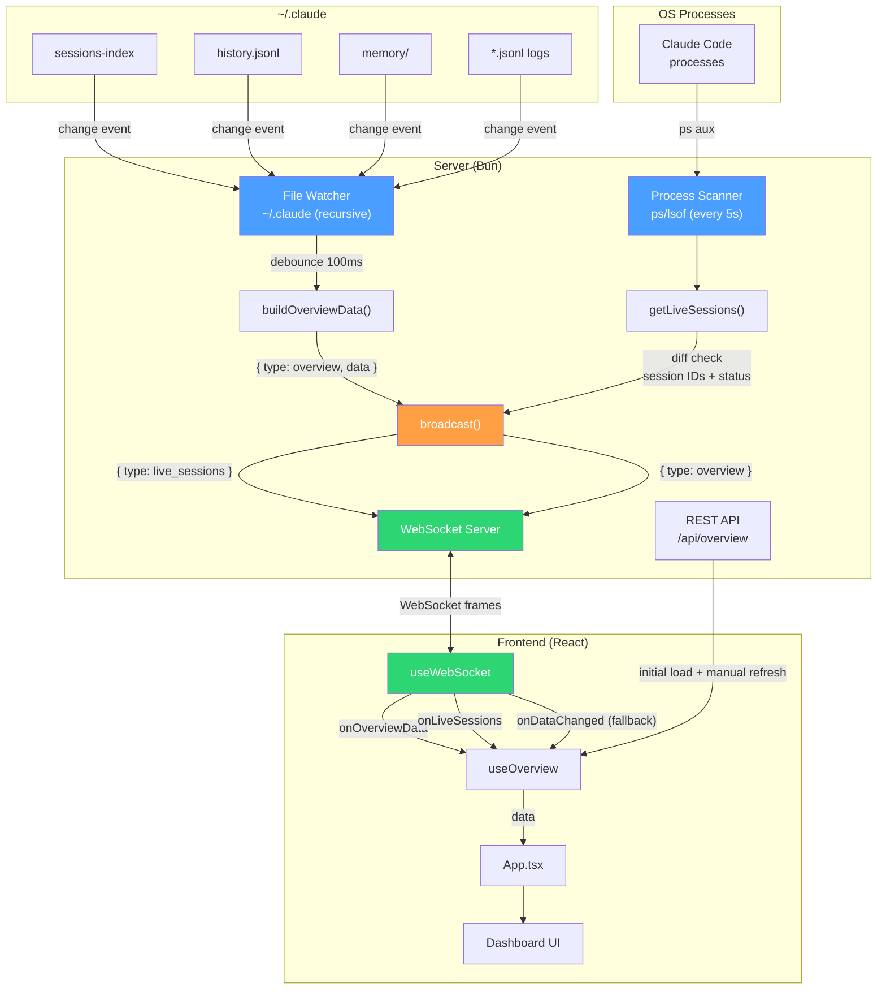

# Ohaninio Manager — Data Flow Architecture

## WebSocket Push Architecture

## Data Flow Summary

| Trigger | Server Action | Client Receives | Client Action |
|---------|--------------|-----------------|---------------|
| Page load | — | — | REST `GET /api/overview` (one-time) |
| File change in `~/.claude` | Build full overview, broadcast | `{ type: "overview", data }` | Replace full state |
| Process scan (5s interval) | Detect Claude processes, diff | `{ type: "live_sessions", sessions }` | Partial state update |
| Manual refresh button | — | — | REST `GET /api/overview` |
| WS reconnect | — | — | Automatic via 3s retry |

## Key Design Decisions

- **No client-side polling** — server pushes all updates via WebSocket
- **Debounced file watcher** (100ms) — prevents flooding on rapid file writes
- **Diff-based process scanning** — only broadcasts when session IDs or statuses change
- **Skips scanning when no clients** — `wsClients.size === 0` check saves CPU
- **REST kept as fallback** — initial load and manual refresh still use HTTP
